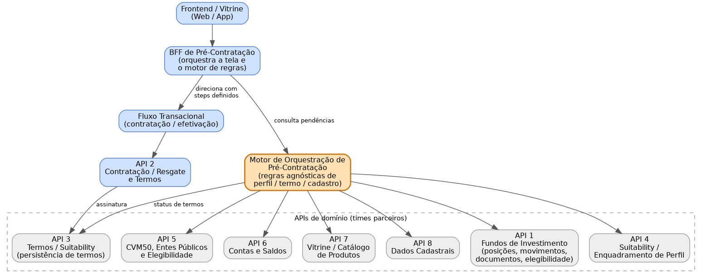
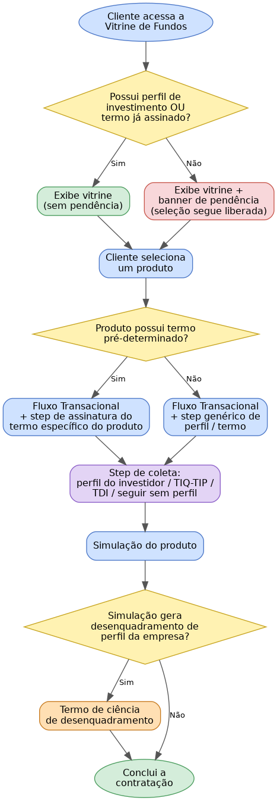

# DOCUMENTO TÉCNICO DE SOLUÇÃO

## Motor de Orquestração de Pré-Contratação de Fundos de Investimento

*Validação de Perfil de Investimento, Termos e Pendências Cadastrais — Desenho Técnico e Fluxo Agnóstico de Pré-Contratação*

**Versão 0.2** — Inclui fichas de contrato por endpoint (por API) e diagramas com fonte editável separada

Julho de 2026 (atualizado em 26/07/2026)

---

## Sumário

> Índice gerado a partir dos títulos deste arquivo (compatível com visualizadores Markdown que geram sumário automaticamente, ex.: GitHub, GitLab, VS Code).

---

## 1. Contexto e Objetivo

### 1.1 Contexto atual

Hoje a jornada de investimento em fundos é composta por três blocos principais que já existem e funcionam de forma independente:

- **Vitrine** — a Vitrine lista produtos e a posição do cliente, aplicando regras de habilitação, suitability e conformidade regulatória antes de liberar a aplicação;
- **Fluxo transacional** — a contratação é sequencial e transacional: cada passo depende do anterior, e a efetivação só ocorre após os termos assinados e o segundo fator validado;
- **Formalização remota** — é a jornada em que o cliente revisa e formaliza (ou recusa) movimentos de aplicação solicitados, assinando termos de ciência de risco quando exigido.

Essas validações (perfil de investimento, termos assinados e pendências cadastrais) hoje tendem a ser tratadas de forma pontual dentro de cada fluxo de produto, o que dificulta a reutilização da mesma lógica por outros times e outros produtos além de fundos.

### 1.2 Objetivo deste documento

Estruturar o desenho técnico de uma jornada de pré-contratação de fundos que:

- valide, antes e durante a contratação, se o cliente possui perfil de investimento vigente, termos assinados e ausência de pendências cadastrais;
- insira, de forma dinâmica, os steps necessários (assinatura de termo, preenchimento de perfil, ciência de desenquadramento) dentro do fluxo transacional já existente, sem duplicar regra em cada produto;
- seja desenhada como um fluxo agnóstico de produto e de canal, para que outros times possam reaproveitar o mesmo motor de validações em suas próprias jornadas de pré-contratação;
- sirva como insumo comum para o time de engenharia (o que construir) e para o time de negócio (como a regra funciona ponta a ponta).

## 2. Escopo

### 2.1 Dentro do escopo

- Desenho da jornada de pré-contratação: vitrine → validação de perfil/termo/cadastro → seleção de produto → steps condicionais de termo/perfil → simulação → validação de desenquadramento → conclusão.
- Proposta de arquitetura de orquestração (Motor de Orquestração + BFF de Pré-Contratação).
- Mapeamento das regras de negócio descritas às 8 APIs hoje utilizadas, com as rotas atuais citadas.
- Modelo de estados da jornada.
- Contrato de interface proposto (ilustrativo) para o motor agnóstico.
- Lista de pontos em aberto que precisam de detalhamento com os times donos de cada API.

### 2.2 Fora do escopo (nesta versão)

- Definição fechada de payloads/contratos técnicos reais de cada endpoint das APIs 1 a 8 — os nomes de rota usados aqui são referências para conexão do fluxo, a detalhar. Um template estruturado para capturar esses contratos, por API, já está disponível na **seção 8** (Fichas de Endpoint).
- Regras específicas de produtos de investimento além de fundos (a solução é desenhada para permitir extensão, mas o desenho detalhado aqui é o de fundos).
- Layout/UX final das telas de vitrine e dos steps do fluxo transacional.

## 3. Visão Geral da Solução Proposta

### 3.1 O problema a resolver

A decisão de "o cliente pode seguir?" e "quais passos faltam antes de concluir a contratação?" depende de regras de perfil, suitability, termos e cadastro que já existem nas APIs 3, 4, 5 e 8. Hoje essa composição de regras tende a ficar implícita dentro do fluxo de cada produto. Isso cria dois riscos: retrabalho quando outro time (outro produto) precisa da mesma validação, e divergência de regra entre jornadas.

### 3.2 A proposta

Criar um Motor de Orquestração de Pré-Contratação: um componente central (serviço próprio ou camada dedicada dentro de um BFF) responsável por consultar as APIs de domínio e devolver um "checklist" de pendências e o conjunto de steps que o fluxo transacional deve apresentar para aquele cliente e aquele produto — independente de qual vitrine ou qual produto está chamando.

Esse motor não substitui as APIs 1 a 8: ele orquestra e interpreta as respostas delas, aplicando a árvore de decisão de negócio descrita na seção 5, e devolve uma resposta agnóstica de canal (web, app) e de produto (fundos hoje, outros produtos amanhã).

### 3.3 Padrão técnico sugerido

- Motor de regras implementado como uma máquina de estados finita (FSM), onde cada estado representa um ponto da jornada (ver seção 6).
- Cada regra de negócio (perfil vigente, termo geral assinado, termo do produto, pendência cadastral, elegibilidade CVM50, desenquadramento) é encapsulada em um "verificador" próprio, que isola a chamada à API de domínio correspondente.
- O BFF de Pré-Contratação conversa apenas com o motor; o motor conversa com as APIs 1, 3, 4, 5, 6, 7 e 8. O fluxo transacional (API 2) recebe do BFF a lista de steps a apresentar.

### 3.4 Benefícios esperados

- Reuso do motor por outros times/produtos que também precisem validar perfil, termo e cadastro antes de uma contratação.
- Regra de negócio centralizada e versionada em um único lugar, reduzindo divergência entre jornadas.
- Mudanças regulatórias (ex.: nova regra de suitability ou novo termo obrigatório) são alteradas no motor, sem exigir alteração em cada fluxo de produto.
- Fluxo transacional (API 2) fica mais simples: ele executa os steps que o motor determinar, sem precisar conhecer a árvore de decisão completa.

## 4. Arquitetura da Solução

A figura abaixo representa os componentes propostos e como eles se conectam às APIs hoje existentes.



> **Fonte editável:** `figura1_componentes.dot` (Graphviz) — ver seção 13 para detalhes de como editar e re-renderizar.

*Figura 1 — Visão de componentes: Vitrine, BFF de Pré-Contratação, Motor de Orquestração e APIs de domínio.*

### 4.1 Componentes

| Componente | Responsabilidade |
|---|---|
| Frontend / Vitrine | Interface web/app onde o cliente visualiza produtos, posições e eventuais banners de pendência. |
| BFF de Pré-Contratação | Camada de orquestração de tela: agrega a resposta do Motor de Orquestração e conteúdo de vitrine/catálogo (API 7) e posições (API 1) para montar a experiência do cliente. Direciona para o fluxo transacional com os steps definidos. |
| Motor de Orquestração de Pré-Contratação | Componente novo e agnóstico proposto neste documento. Aplica a árvore de decisão de negócio (seção 5), consultando as APIs 1, 3, 4, 5, 6, 7 e 8, e devolve o checklist de pendências e os steps necessários. |
| Fluxo Transacional / API 2 | Executa a contratação em si (sequencial), incorporando os steps adicionais (assinatura de termo, coleta de perfil, ciência de desenquadramento) indicados pelo motor. Aciona a API 3 para persistência de termos. |
| APIs 1, 3, 4, 5, 6, 7, 8 | APIs de domínio já existentes, mantidas por outros times, conforme descrito na seção 7. |

> **Observação:** O Motor de Orquestração pode nascer como uma camada dentro do BFF (mais rápido de entregar) e evoluir para um serviço próprio quando outro time de fato precisar reutilizá-lo — mas o contrato de interface (seção 9) já deve ser desenhado como se fosse um serviço independente, para não gerar acoplamento desnecessário com a Vitrine de fundos.

## 5. Fluxo de Negócio Ponta a Ponta

A figura abaixo representa a árvore de decisão descrita para a jornada de pré-contratação de fundos.



> **Fonte editável:** `figura2_fluxo_decisao.dot` (Graphviz) — ver seção 13 para detalhes de como editar e re-renderizar.

*Figura 2 — Fluxo de decisão da pré-contratação, da vitrine até a conclusão.*

### 5.1 Passo a passo

1. **Acesso à vitrine** — O cliente acessa a vitrine de investimentos em fundos. O motor consulta se o cliente possui perfil de investimento vigente (API 4) ou termo já assinado (API 3).
2. **(2a) Sem pendência** — Se possui perfil ou termo, a vitrine é exibida normalmente e o cliente pode selecionar um produto para investir/aplicar, seguindo direto para o fluxo transacional.
3. **(2b) Com pendência** — Se não possui, a vitrine exibe um banner de pendência — mas a seleção de produto continua liberada mesmo assim.
4. **Seleção de produto** — Em ambos os casos o cliente escolhe o produto. O motor verifica se aquele produto tem um termo pré-determinado associado (atributo do catálogo, API 7, cruzado com as regras de termo da API 3).
5. **(4a) Termo pré-determinado existe** — O cliente é direcionado ao fluxo transacional (API 2) com um step adicional para assinatura do termo específico do produto — apresentando o termo ou a rota adequada para aquele produto.
6. **(4b) Termo pré-determinado não existe** — O cliente também é direcionado ao fluxo transacional (API 2), mas com um step adicional genérico (item 7) em vez do termo específico do produto.
7. **Step de coleta** — Em ambos os caminhos (4a/4b), o step adicional do fluxo transacional oferece ao cliente as opções de: preencher o perfil de investidor (API 4); preencher o termo de investidor qualificado ou profissional (TIQ/TIP); preencher o TDI — Termo de Investidor; ou seguir sem perfil/termo, mantendo a pendência.
8. **Simulação** — Concluído o step de coleta (ou a opção de seguir sem perfil), o cliente avança para a simulação do produto escolhido (dados de posição/benchmark da API 1, saldo da API 6).
9. **Verificação de desenquadramento** — Após a simulação, o motor verifica se a operação gera desenquadramento do perfil do cliente em relação à política da empresa para aquele produto (API 4).
10. **(8a) Desenquadra** — Se houver desenquadramento, é apresentado o termo de ciência de desenquadramento; após a assinatura, o cliente conclui a contratação.
11. **(8b) Não desenquadra** — Se não houver desenquadramento, não existe termo adicional e o cliente conclui a contratação diretamente.

> **Observação:** A validação de pendências cadastrais (API 8) e de elegibilidade/CVM 50 e entes públicos (API 5), citadas no início da demanda, não estavam detalhadas na árvore de decisão original. A recomendação técnica é tratá-las no mesmo ponto de decisão do passo 1 (compondo o mesmo checklist de pendências e o mesmo banner da vitrine) e, quando aplicável, revalidá-las antes da efetivação (passo 8). Esse ponto precisa ser confirmado com o time de negócio — ver seção 11.

## 6. Máquina de Estados da Jornada

Proposta de estados para o Motor de Orquestração controlar a jornada de forma explícita e auditável.

| Estado | Descrição | Condição de entrada | Próximo(s) estado(s) |
|---|---|---|---|
| INICIO | Cliente acessa a vitrine de fundos. | Acesso à vitrine. | VITRINE_LIBERADA ou VITRINE_COM_PENDENCIA |
| VITRINE_LIBERADA | Cliente possui perfil/termo vigente; sem banner. | Perfil ou termo OK (API 3 / API 4). | PRODUTO_SELECIONADO |
| VITRINE_COM_PENDENCIA | Vitrine exibida com banner; seleção segue liberada. | Perfil e termo ausentes (API 3 / API 4). | PRODUTO_SELECIONADO |
| PRODUTO_SELECIONADO | Cliente escolheu um produto para investir/aplicar. | Seleção na vitrine (API 7). | STEPS_DEFINIDOS |
| STEPS_DEFINIDOS | Motor calcula se há termo pré-determinado do produto e monta os steps do fluxo transacional. | Consulta a atributos do produto (API 7) e regras de termo (API 3). | COLETA_PERFIL_TERMO |
| COLETA_PERFIL_TERMO | Step do fluxo transacional: preenche perfil, TIQ/TIP, TDI, ou segue sem perfil. | Entrada no fluxo transacional (API 2). | SIMULACAO |
| SIMULACAO | Simulação do produto (valores, benchmark, saldo). | Perfil/termo tratado (ou pendência aceita). | VALIDACAO_ENQUADRAMENTO |
| VALIDACAO_ENQUADRAMENTO | Motor verifica desenquadramento do perfil frente à política da empresa. | Simulação concluída (API 4). | TERMO_DESENQUADRAMENTO ou CONCLUIDO |
| TERMO_DESENQUADRAMENTO | Apresenta e coleta a assinatura do termo de ciência de desenquadramento. | Desenquadramento identificado. | CONCLUIDO |
| CONCLUIDO | Contratação efetivada. | 2º fator validado e termos assinados (API 2). | — |

## 7. Mapeamento de Regras de Negócio × APIs × Rotas Atuais

Tabela de referência para conectar cada ponto da jornada às APIs e rotas já existentes, citadas na demanda original. Onde a regra ainda não está clara o suficiente para apontar uma rota única, foi marcada como "a detalhar".

| Regra / etapa de negócio | API | Rota atual de referência | Observação |
|---|---|---|---|
| Consultar perfil de investimento vigente | API 4 | perfil de investidor | Usada no ponto de decisão inicial (passo 1). |
| Consultar termo geral já assinado | API 3 | assinatura de termos (consulta) | Usada no ponto de decisão inicial (passo 1), em conjunto com o perfil. |
| Exibir catálogo de produtos | API 7 | catálogo de produto de fundos | Alimenta a vitrine (BFF). |
| Consultar posições do cliente | API 1 | consulta de posições | Alimenta a vitrine (BFF). |
| Consultar fundos elegíveis para aplicação | API 1 | fundos elegíveis para aplicação | Filtra produtos exibidos/selecionáveis. |
| Consultar saldo disponível em conta | API 6 | saldo disponível em conta | Usado na simulação e antes da efetivação. |
| Verificar se produto tem termo pré-determinado | API 7 + API 3 | catálogo de produto de fundos / termo de ciência de risco | A detalhar: confirmar se o atributo "termo obrigatório" vive no catálogo (API 7) ou na regra de suitability (API 3). |
| Assinar termo específico do produto | API 3 (via API 2) | assinatura de termos | Step adicionado ao fluxo transacional (passo 4a). |
| Iniciar / pré-validar contratação | API 2 | consulta/pré-validação de contratação | Ponto de entrada do fluxo transacional após seleção do produto. |
| Preencher perfil de investidor | API 4 | perfil de investidor | Uma das opções do step de coleta (passo 5). |
| Assinar termo de investidor qualificado/profissional (TIQ/TIP) | API 3 | assinatura de termos | A detalhar: confirmar nome oficial do termo (o texto original cita "TCQ") e regra de elegibilidade associada. |
| Assinar TDI — Termo de Investidor | API 3 | assinatura de termos | A detalhar: confirmar em que caso o TDI é oferecido em vez do TIQ/TIP. |
| Seguir sem perfil / manter pendência | A detalhar | — | A detalhar: qual API registra que o cliente optou por seguir sem perfil (auditoria/compliance). |
| Consultar validações de suitability | API 4 | validações de suitability | Usada na simulação e na verificação de desenquadramento. |
| Consultar benchmarks do produto | API 1 | benchmarks dos produtos | Usado na tela de simulação (passo 6). |
| Verificar desenquadramento de perfil x produto | API 4 | validações de suitability | Ponto de decisão do passo 7. |
| Assinar termo de ciência de desenquadramento | API 3 | termo de ciência de risco | Step do passo 8a. |
| Criar a contratação | API 2 | cria a contratação | Efetivação, após todos os steps concluídos. |
| Efetivar contratação (2º fator) | API 2 | efetivar contratação | Conclusão final da jornada (passo 8a/8b). |
| Validações/permissão de aplicação | API 2 / API 4 | validações/permissão de aplicação | A detalhar: confirmar se é regra de suitability, de saldo, ou combinação de ambas. |
| Consultar documentos do fundo | API 1 | documentos do fundo | Apoio informativo na vitrine/simulação, fora da árvore de decisão principal. |
| Consultar/registrar movimentos solicitados | API 1 | movimentos solicitados | Usado na formalização remota (fora do escopo direto desta jornada, mas compartilha regra de termos). |
| Validar pendências cadastrais | API 8 | validações de dados cadastrais | A detalhar: confirmar se compõe o checklist inicial (passo 1) e/ou bloqueia a efetivação (passo 8). |
| Consultar CVM 50, entes públicos e elegibilidade | API 5 | consulta de CVM 50, entes públicos e elegibilidade | A detalhar: aplicável a perfis específicos de cliente (ex.: entes públicos); confirmar em que ponto da jornada entra. |
| Consultar saldo investido | API 6 | saldo investido | Apoio informativo na vitrine/posições. |

## 8. Fichas de Endpoint — Contratos e Regras de Negócio (Hoje × Novo Fluxo)

Esta seção traz uma ficha por API (1 a 8) para registrar, em um único lugar, a rota atual, a regra de negócio de hoje, o papel da API no novo fluxo do Motor de Orquestração e o contrato técnico (request/response). As linhas de contrato estão marcadas como “a preencher” — use esta estrutura como o formulário de trabalho ao validar cada API com o time dono.

> **Como usar:** duplique o padrão de tabela desta seção para novos endpoints que entrarem no escopo; mantenha sempre as mesmas sete linhas (rota, regra hoje, regra no novo fluxo, request, response, autenticação, pendências) para preservar a consistência do documento.

### 8.1 API 1 — Fundos de Investimento (posições, movimentos, documentos, elegibilidade)

**API 1 — Fundos de Investimento**

| Campo | Conteúdo |
|---|---|
| Rota(s) atual(is) referenciada(s) | Consulta de posições · Fundos elegíveis para aplicação · Benchmarks dos produtos · Documentos do fundo · Movimentos solicitados. |
| Regra de negócio HOJE (fluxo atual) | Fornece dados de posição do cliente, fundos elegíveis para aplicação, benchmarks dos produtos, documentos do fundo e movimentos solicitados; hoje consumida de forma pontual por cada tela que precisa desses dados. |
| Papel no NOVO FLUXO (Motor de Orquestração) | O BFF consulta para montar a vitrine (posições, documentos, apoio informativo) e para filtrar os produtos elegíveis na seleção (passo 3). O motor consulta o benchmark do produto durante a simulação (passo 6). |
| Contrato — Request | *A preencher com o time dono da API — payload, campos, tipos, obrigatoriedade* |
| Contrato — Response | *A preencher com o time dono da API — payload, campos, tipos, obrigatoriedade* |
| Autenticação / Headers | *A preencher — mecanismo de autenticação, headers obrigatórios, versionamento* |
| Pendências / perguntas em aberto | Nenhuma pendência de fluxo mapeada nesta versão; falta apenas fechar o contrato técnico real (ver seção 11). |

### 8.2 API 2 — Contratação / Resgate e Termos (Fluxo Transacional)

**API 2 — Fluxo Transacional**

| Campo | Conteúdo |
|---|---|
| Rota(s) atual(is) referenciada(s) | Consulta / pré-validação de contratação · Cria a contratação · Efetivar contratação (2º fator) · Validações / permissão de aplicação. |
| Regra de negócio HOJE (fluxo atual) | Executa a contratação de forma sequencial e transacional; a efetivação só ocorre após os termos assinados e o segundo fator validado. |
| Papel no NOVO FLUXO (Motor de Orquestração) | Recebe do BFF a lista de “stepsNecessarios” definida pelo motor e incorpora esses steps (assinatura de termo, coleta de perfil, ciência de desenquadramento) antes da efetivação; aciona a API 3 para persistir cada termo assinado. |
| Contrato — Request | *A preencher com o time dono da API — payload, campos, tipos, obrigatoriedade* |
| Contrato — Response | *A preencher com o time dono da API — payload, campos, tipos, obrigatoriedade* |
| Autenticação / Headers | *A preencher — mecanismo de autenticação, headers obrigatórios, versionamento* |
| Pendências / perguntas em aberto | Confirmar se “validações/permissão de aplicação” é regra de suitability, de saldo, ou combinação de ambas (ver seção 11). |

### 8.3 API 3 — Termos / Suitability (persistência de termos)

**API 3 — Termos / Suitability**

| Campo | Conteúdo |
|---|---|
| Rota(s) atual(is) referenciada(s) | Assinatura de termos (consulta) · Assinatura de termos (registro) · Termo de ciência de risco. |
| Regra de negócio HOJE (fluxo atual) | Registra e consulta a assinatura de termos gerais e específicos do cliente. |
| Papel no NOVO FLUXO (Motor de Orquestração) | Consultada pelo motor no passo 1 (termo geral assinado?) e no passo 3 (produto tem termo pré-determinado?, cruzado com a API 7); acionada pelo fluxo transacional (API 2) para persistir cada termo coletado nos steps (termo do produto, TIQ/TIP, TDI, termo de ciência de desenquadramento). |
| Contrato — Request | *A preencher com o time dono da API — payload, campos, tipos, obrigatoriedade* |
| Contrato — Response | *A preencher com o time dono da API — payload, campos, tipos, obrigatoriedade* |
| Autenticação / Headers | *A preencher — mecanismo de autenticação, headers obrigatórios, versionamento* |
| Pendências / perguntas em aberto | Confirmar nome oficial do termo de investidor qualificado/profissional (o texto original cita “TCQ”); confirmar quando oferecer TIQ/TIP vs. TDI; confirmar se o atributo “termo pré-determinado” vive na API 7 ou na API 3 (ver seção 11). |

### 8.4 API 4 — Suitability / Enquadramento de Perfil

**API 4 — Suitability / Enquadramento de Perfil**

| Campo | Conteúdo |
|---|---|
| Rota(s) atual(is) referenciada(s) | Perfil de investidor · Validações de suitability. |
| Regra de negócio HOJE (fluxo atual) | Mantém o perfil de investimento do cliente e as validações de suitability. |
| Papel no NOVO FLUXO (Motor de Orquestração) | Consultada pelo motor no passo 1 (perfil vigente?), no step de coleta (preenchimento do perfil) e no passo 7 (verificação de desenquadramento do perfil frente à política da empresa, após a simulação). |
| Contrato — Request | *A preencher com o time dono da API — payload, campos, tipos, obrigatoriedade* |
| Contrato — Response | *A preencher com o time dono da API — payload, campos, tipos, obrigatoriedade* |
| Autenticação / Headers | *A preencher — mecanismo de autenticação, headers obrigatórios, versionamento* |
| Pendências / perguntas em aberto | Critério exato de cálculo do desenquadramento — antes ou depois da simulação, e quais variáveis entram (ver seção 11). |

### 8.5 API 5 — CVM 50, Entes Públicos e Elegibilidade

**API 5 — CVM 50 / Entes Públicos / Elegibilidade**

| Campo | Conteúdo |
|---|---|
| Rota(s) atual(is) referenciada(s) | Consulta de CVM 50, entes públicos e elegibilidade. |
| Regra de negócio HOJE (fluxo atual) | Não estava detalhada na árvore de decisão original recebida com a demanda. |
| Papel no NOVO FLUXO (Motor de Orquestração) | Proposta: compor o checklist do passo 1 junto com perfil/termo/cadastro, e revalidar antes da efetivação (passo 8), aplicável a perfis específicos de cliente — a confirmar com negócio. |
| Contrato — Request | *A preencher com o time dono da API — payload, campos, tipos, obrigatoriedade* |
| Contrato — Response | *A preencher com o time dono da API — payload, campos, tipos, obrigatoriedade* |
| Autenticação / Headers | *A preencher — mecanismo de autenticação, headers obrigatórios, versionamento* |
| Pendências / perguntas em aberto | Em que ponto exato da jornada entra e para quais perfis de cliente é aplicável (ver seção 11). |

### 8.6 API 6 — Contas e Saldos

**API 6 — Contas e Saldos**

| Campo | Conteúdo |
|---|---|
| Rota(s) atual(is) referenciada(s) | Saldo disponível em conta · Saldo investido. |
| Regra de negócio HOJE (fluxo atual) | Fornece o saldo disponível e o saldo investido do cliente. |
| Papel no NOVO FLUXO (Motor de Orquestração) | Saldo disponível usado na simulação (passo 6) e antes da efetivação; saldo investido como apoio informativo na vitrine/posições. |
| Contrato — Request | *A preencher com o time dono da API — payload, campos, tipos, obrigatoriedade* |
| Contrato — Response | *A preencher com o time dono da API — payload, campos, tipos, obrigatoriedade* |
| Autenticação / Headers | *A preencher — mecanismo de autenticação, headers obrigatórios, versionamento* |
| Pendências / perguntas em aberto | Nenhuma pendência de fluxo mapeada nesta versão. |

### 8.7 API 7 — Vitrine / Catálogo de Produtos

**API 7 — Vitrine / Catálogo de Produtos**

| Campo | Conteúdo |
|---|---|
| Rota(s) atual(is) referenciada(s) | Catálogo de produto de fundos. |
| Regra de negócio HOJE (fluxo atual) | Alimenta a vitrine com os produtos de fundos disponíveis para o cliente. |
| Papel no NOVO FLUXO (Motor de Orquestração) | Consultada pelo motor no passo 3 para verificar se o produto selecionado tem termo pré-determinado (atributo do catálogo, cruzado com a regra de termo da API 3); alimenta o BFF para montar a tela de vitrine. |
| Contrato — Request | *A preencher com o time dono da API — payload, campos, tipos, obrigatoriedade* |
| Contrato — Response | *A preencher com o time dono da API — payload, campos, tipos, obrigatoriedade* |
| Autenticação / Headers | *A preencher — mecanismo de autenticação, headers obrigatórios, versionamento* |
| Pendências / perguntas em aberto | Confirmar se o atributo “produto possui termo pré-determinado” deve viver no catálogo (API 7) ou na engine de suitability (API 3) (ver seção 11). |

### 8.8 API 8 — Dados Cadastrais

**API 8 — Dados Cadastrais**

| Campo | Conteúdo |
|---|---|
| Rota(s) atual(is) referenciada(s) | Validações de dados cadastrais. |
| Regra de negócio HOJE (fluxo atual) | Não estava detalhada na árvore de decisão original recebida com a demanda. |
| Papel no NOVO FLUXO (Motor de Orquestração) | Proposta: compor o checklist/banner do passo 1 e, possivelmente, bloquear a efetivação no passo 8 — a confirmar com negócio. |
| Contrato — Request | *A preencher com o time dono da API — payload, campos, tipos, obrigatoriedade* |
| Contrato — Response | *A preencher com o time dono da API — payload, campos, tipos, obrigatoriedade* |
| Autenticação / Headers | *A preencher — mecanismo de autenticação, headers obrigatórios, versionamento* |
| Pendências / perguntas em aberto | Confirmar se a pendência cadastral compõe apenas o banner inicial, bloqueia a efetivação, ou ambos (ver seção 11). |

## 9. Contrato de Interface Proposto do Motor de Orquestração

Proposta ilustrativa de contrato para o motor agnóstico — nomes de campos e rota são exemplificativos e devem ser ajustados ao padrão de API interno da empresa.

### 9.1 Consulta de checklist de pré-contratação

```
GET /pre-contratacao/v1/checklist?clienteId={id}&produtoId={id}&canal={web|app}
```

Resposta ilustrativa:

```json
{
  "clienteId": "123456",
  "produtoId": "FIC-RF-001",
  "pendencias": {
    "perfilInvestidor": false,
    "termoGeralAssinado": false,
    "pendenciaCadastral": false,
    "elegibilidadeCvm50": true
  },
  "produto": {
    "possuiTermoPreDeterminado": true,
    "termoId": "TERMO-FIC-RF-001"
  },
  "stepsNecessarios": [
    "ASSINATURA_TERMO_PRODUTO",
    "COLETA_PERFIL_OU_TERMO",
    "SIMULACAO",
    "VALIDACAO_ENQUADRAMENTO"
  ],
  "estadoAtual": "STEPS_DEFINIDOS"
}
```

### 9.2 Registro de conclusão de um step (opcional)

```
POST /pre-contratacao/v1/eventos
```

Usado pelo fluxo transacional (API 2) para informar ao motor que um step foi concluído (ex.: termo assinado, perfil preenchido), permitindo recalcular o checklist e o próximo estado.

> **Observação:** Este contrato é um ponto de partida para discussão com o time de arquitetura; o formato final deve seguir o padrão de API já adotado internamente (autenticação, versionamento, tratamento de erro).

## 10. Considerações para Frontend e BFF

- O frontend consome uma única chamada de "checklist" do BFF de Pré-Contratação, sem precisar saber quais das 8 APIs geraram cada pendência — isso mantém o frontend agnóstico e simplifica a manutenção.
- O banner de pendência da vitrine e os steps do fluxo transacional podem ser guiados pelo mesmo campo "stepsNecessarios", evitando lógica de negócio duplicada em telas diferentes.
- Como a jornada é sequencial (cada passo depende do anterior), o BFF deve tratar o "estadoAtual" retornado pelo motor como fonte de verdade para decidir qual tela/step mostrar a seguir, evitando que o frontend precise reconstruir essa lógica.
- Para outros times reaproveitarem o motor, a integração recomendada é via chamada direta ao motor (e não ao BFF de fundos), preservando o desacoplamento.

## 11. Pontos em Aberto para Validação

Itens que dependem de definição com os times donos das APIs 1 a 8 e/ou com o time de negócio antes da construção:

- Contratos técnicos reais (payload, autenticação, códigos de erro) de cada rota listada na seção 7.
- Onde exatamente a pendência cadastral (API 8) entra na árvore de decisão: compõe o banner inicial, bloqueia a efetivação, ou ambos.
- Em que ponto da jornada a consulta de CVM 50/entes públicos/elegibilidade (API 5) deve ocorrer, e para quais perfis de cliente ela é aplicável.
- Regra exata de quando oferecer o termo de investidor qualificado/profissional (TIQ/TIP) versus o TDI — o texto original cita "TCQ", que precisa ser confirmado como o nome correto do termo.
- Onde e como se registra a opção do cliente de "seguir sem perfil", para fins de auditoria e compliance.
- Se o atributo "produto possui termo pré-determinado" deve viver no catálogo (API 7) ou na engine de suitability (API 3).
- Critério exato de cálculo do desenquadramento de perfil frente à política da empresa (API 4): calculado antes ou depois da simulação, e quais variáveis entram.
- SLA e estratégia de contingência (timeout, fallback) para cada API consultada pelo motor.
- Formato definitivo do contrato do motor de orquestração, alinhado ao padrão de API interno.

## 12. Próximos Passos Sugeridos

- Validar com os times donos das APIs 1 a 8 o mapeamento da seção 7 e destravar os pontos em aberto da seção 11.
- Detalhar os contratos técnicos (payloads reais) das rotas necessárias ao motor.
- Prototipar o Motor de Orquestração (mesmo com respostas mockadas) para validar a máquina de estados junto ao time de negócio.
- Definir, com o time de arquitetura, se o motor nasce como camada do BFF de fundos ou como serviço independente desde o início.
- Planejar a extensão do motor para outros produtos além de fundos, usando fundos como piloto.

## 13. Arquivos Complementares Entregues com Este Documento

Além deste Markdown (e do Word equivalente), esta atualização é entregue com os seguintes arquivos, para facilitar versionamento e futuras alterações:

- **documento_tecnico_pre_contratacao_fundos_v0.2.docx** — versão Word deste documento.
- **documento_tecnico_pre_contratacao_fundos_v0.2.md** — este arquivo.
- **figura1_componentes.dot / figura1_componentes.png** — diagrama de componentes (Figura 1); fonte editável em Graphviz DOT.
- **figura2_fluxo_decisao.dot / figura2_fluxo_decisao.png** — diagrama de fluxo de decisão (Figura 2); fonte editável em Graphviz DOT.

**Como editar os diagramas:** abra o arquivo `.dot` em qualquer editor de texto (ou em [dreampuf.github.io/GraphvizOnline](https://dreampuf.github.io/GraphvizOnline/) para pré-visualizar), ajuste nós, rótulos, cores ou setas, e gere a imagem novamente com `dot -Tpng arquivo.dot -o arquivo.png` (requer Graphviz instalado) ou pelo próprio editor online.

## 14. Registro de Versões

| Versão | Data | Alteração |
|---|---|---|
| 0.1 | Julho/2026 | Rascunho inicial para validação com Engenharia e Negócio. |
| 0.2 | 26/07/2026 | Adição da seção 8 (Fichas de Endpoint — rota, regra hoje x novo fluxo e contrato, por API); diagramas de arquitetura passam a ter arquivos-fonte editáveis separados (.dot); geração de versão Markdown do documento; ajuste de numeração das seções 9 a 12; pequenas atualizações de referências cruzadas. |
