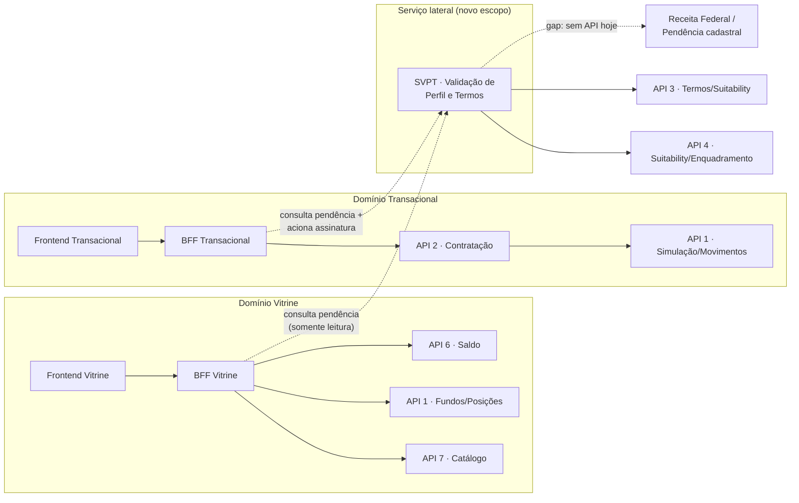
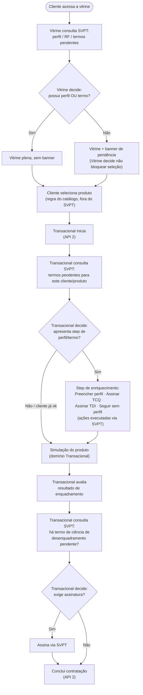
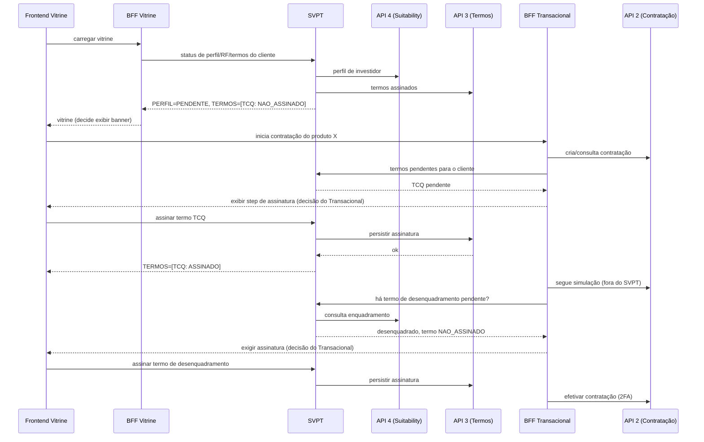

# Diagramas de arquitetura — SVPT (Serviço de Validação de Perfil e Termos)

Extraído de `pre-contratacao-fundos.md` (v0.2), para uso isolado.

## Arquitetura proposta

## Fluxograma de decisão

## Sequência entre serviços

