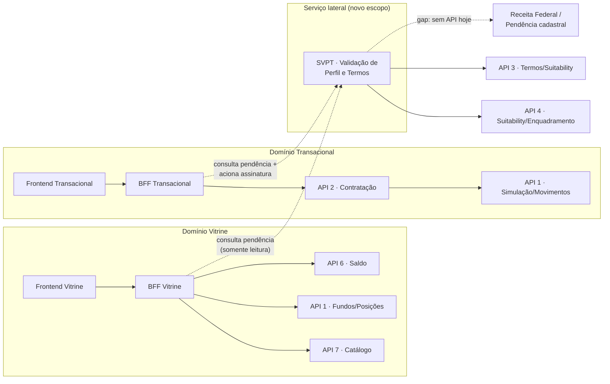
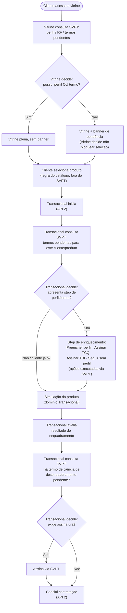
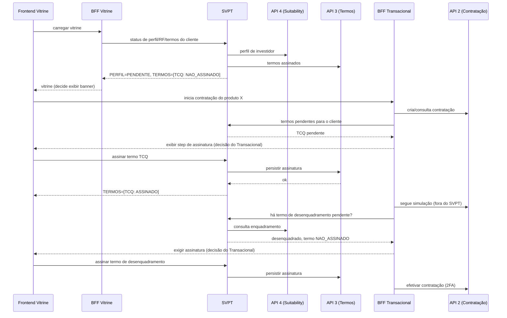

# Serviço de validação de perfil e termos

**Investimentos · Fundos · Pré-Contratação — Desenho técnico v0.2**
*26 jul 2026 — substitui a v0.1 (sem máquina de estados)*

Revisão do desenho técnico: o componente proposto tem escopo estrito — validar perfil, sinalizar pendência com a Receita Federal e gerenciar termos pendentes/assinatura. Ele nunca bloqueia a jornada; apenas informa. Quem decide bloquear ou liberar é sempre a Vitrine ou o Transacional.

---

## Sumário

1. [Contexto e objetivo](#01-contexto-e-objetivo)
2. [Escopo: serviço informativo, não bloqueante](#02-escopo-serviço-informativo-não-bloqueante)
3. [Visão geral do fluxo](#03-visão-geral-do-fluxo)
4. [Arquitetura proposta](#04-arquitetura-proposta)
5. [Fluxograma de decisão](#05-fluxograma-de-decisão)
6. [Sequência entre serviços](#06-sequência-entre-serviços)
7. [Mapa de APIs atuais](#07-mapa-de-apis-atuais)
8. [Contrato do serviço (SVPT)](#08-contrato-do-serviço-svpt)
9. [Regras por etapa](#09-regras-por-etapa)
10. [O que fica de fora do BFF](#10-o-que-fica-de-fora-do-bff-do-svpt)
11. [Riscos e pendências de validação](#11-riscos-e-pendências-de-validação)
12. [Glossário](#12-glossário)

---

## 01 · Contexto e objetivo

Esta versão estreita o escopo do componente proposto anteriormente. Ele deixa de tentar orquestrar a jornada inteira (vitrine, catálogo, saldo, máquina de estados de contratação) e passa a fazer uma única coisa bem definida: **responder "esse cliente tem pendência de perfil, cadastro/Receita Federal ou termo — e quais termos ele ainda precisa assinar" e, quando acionado, assinar o termo**.

A decisão de bloquear a navegação, exibir banner, impedir aplicação ou permitir seguir mesmo com pendência continua **inteiramente com a Vitrine e com o Transacional**. O serviço não tem opinião sobre UX de bloqueio — ele só entrega o dado.

## 02 · Escopo: serviço informativo, não bloqueante

### O que este serviço faz

- **Valida perfil de investidor** — lê e consolida o status vindo da API 4 (Suitability/Enquadramento).
- **Sinaliza pendência com a Receita Federal** — hoje sem API integrada; ver *gap de integração* nas seções 07 e 11.
- **Lista termos pendentes de assinatura** — consolida o que falta assinar (TCQ, TDI, termo de risco, termo de desenquadramento) a partir da API 3.
- **Assina o termo** — expõe a ação de assinatura, delegando a persistência real para a API 3.

### O que este serviço explicitamente não faz

- Não lista catálogo de produto, benchmark ou fundos elegíveis (isso é Vitrine / API 7 / API 1 / API 5).
- Não consulta nem exibe saldo ou posição (API 6 / API 1).
- Não decide se a jornada deve travar, exibir banner ou permitir avanço — apenas retorna o status para quem chamou decidir.
- Não guarda uma máquina de estados própria da contratação — quem controla o funil transacional continua sendo a API 2.

> **Regra de ouro**: toda chamada a este serviço é *read + inform* (ou *write pontual de assinatura*). Nunca um `bloquear=true/false` na resposta — o campo que existe é sempre um status de fato (`PENDENTE`, `OK`, `NAO_ASSINADO`), e cabe ao consumidor (Vitrine ou Transacional) decidir o que fazer com esse fato.

## 03 · Visão geral do fluxo

O relato de negócio permanece o mesmo — o que muda é quem toma cada decisão. O serviço aparece nos pontos abaixo como fonte de informação, nunca como guarda de bloqueio.

1. **Entrada pela vitrine** — *Serviço informa* se perfil/termo existe. **Vitrine decide** exibir banner e, mesmo com pendência, mantém seleção de produto liberada.
2. **Seleção de produto** — Vitrine/catálogo decide se o produto tem termo pré-determinado (dado do produto, não deste serviço) e direciona ao transacional.
3. **Step de enriquecimento** — *Serviço informa* quais termos estão pendentes e expõe a ação de assinatura (perfil, TCQ, TDI). **Transacional decide** se apresenta o step, se obriga ou permite seguir sem perfil.
4. **Simulação do produto** — Segue no domínio do Transacional / API 1, sem envolvimento deste serviço.
5. **Verificação de desenquadramento** — Cálculo de enquadramento é do domínio de Suitability (API 4); *serviço informa* se há termo de ciência de desenquadramento pendente. **Transacional decide** se exige assinatura antes de concluir.
6. **Efetivação** — Segundo fator + efetivação seguem 100% no Transacional (API 2).

## 04 · Arquitetura proposta

O componente — chamado aqui de **SVPT (Serviço de Validação de Perfil e Termos)** — é consumido diretamente por Vitrine e Transacional, cada um com seu próprio BFF. Ele não se posiciona "na frente" da Vitrine nem do Transacional; é um serviço lateral, consultado por ambos.



Vitrine e Transacional continuam com seus próprios BFFs fazendo o que já fazem hoje (catálogo, saldo, simulação, contratação). O SVPT não participa dessas chamadas — ele só responde quando perguntado sobre perfil/pendência/termo.

> ⚠️ **Gap de integração**: não existe, entre as 8 APIs listadas, uma fonte para pendência de Receita Federal. É preciso mapear com o time de Cadastro (API 8) ou compliance se essa informação já existe em algum sistema interno antes de desenhar a integração.

## 05 · Fluxograma de decisão

Os losangos de decisão pertencem à Vitrine ou ao Transacional. O SVPT nunca aparece como dono de uma decisão — apenas como origem do dado consultado.



## 06 · Sequência entre serviços

Caminho de exemplo: cliente sem perfil, produto com termo pré-determinado, resultado desenquadrado — o SVPT respondendo apenas com informação, nunca decidindo.



## 07 · Mapa de APIs atuais

Apenas as rotas que entram no escopo estreito do SVPT. Catálogo, saldo, posições e simulação seguem sendo consumidos diretamente por Vitrine/Transacional, fora deste serviço.

| Capacidade | API dona | Papel do SVPT | Observação |
|---|---|---|---|
| Perfil de investidor | **API 4** | Consulta e repassa status | Fonte única de verdade — SVPT não recalcula |
| Validações de suitability / enquadramento | API 4 | Consulta status pós-simulação quando acionado | ⚠️ a validar se API 4 expõe reavaliação sob demanda |
| Assinatura de termos | **API 3** | Aciona e confirma persistência | Cobre TCQ, TDI, termo de risco, termo de desenquadramento |
| Termo de ciência de risco / desenquadramento | API 3 | Lista como pendente + assina | — |
| Pendência com Receita Federal | 🚫 nenhuma das 8 APIs | Deveria consultar, mas não há fonte hoje | 🚫 gap de integração — ver seção 11 |
| Validações de dados cadastrais | API 8 | ⚠️ a validar se entra no escopo do SVPT ou fica só com a Vitrine | Ver nota abaixo |

Fora do escopo do SVPT (seguem diretos com seus donos): catálogo de produto (API 7), fundos elegíveis/posições/documentos/movimentos (API 1), elegibilidade CVM50/entes públicos (API 5), saldo (API 6).

## 08 · Contrato do serviço (SVPT)

Endpoints reduzidos ao escopo: consultar status (perfil, Receita Federal, termos) e assinar termo. Nenhum endpoint decide navegação.

| Método | Rota | Função |
|---|---|---|
| `GET` | `/v1/validacao-perfil-termos/clientes/{id}/status` | Retorna status consolidado: perfil (API 4), pendência Receita Federal (gap), termos pendentes (API 3). Somente leitura, sem campo de bloqueio. |
| `GET` | `/v1/validacao-perfil-termos/clientes/{id}/termos` | Lista termos pendentes de assinatura por tipo (TCQ, TDI, risco, desenquadramento) |
| `POST` | `/v1/validacao-perfil-termos/clientes/{id}/termos/{tipo}/assinar` | Aciona assinatura do termo indicado, delegando persistência à API 3 |
| `GET` | `/v1/validacao-perfil-termos/clientes/{id}/perfil` | Retorna status de perfil de investidor (espelho direto da API 4) |

### Forma da resposta de status (rascunho)

```json
{
  "clienteId": "string",
  "perfil": { "status": "PENDENTE", "origem": "API4" },
  "receitaFederal": { "status": "NAO_DISPONIVEL", "motivo": "sem integração ainda" },
  "termos": [
    { "tipo": "TCQ", "status": "NAO_ASSINADO", "origem": "API3" },
    { "tipo": "TERMO_DESENQUADRAMENTO", "status": "NAO_APLICAVEL", "origem": "API3" }
  ]
}
```

*Observação*: não existe campo `bloquear` ou `pode_prosseguir`. Quem interpreta o status e decide navegação é sempre quem chamou (Vitrine ou Transacional).

> ⚠️ **A validar**: confirmar com o time de Suitability (API 3/4) se dá para consultar status "assinado/pendente" em lote por cliente, ou se é preciso um round-trip por tipo de termo.

## 09 · Regras por etapa

### 9.1 Entrada na vitrine

- SVPT informa perfil e termos pendentes. **Vitrine decide** exibir banner; a seleção de produto nunca é travada pelo SVPT.

### 9.2 Step de enriquecimento (transacional)

- SVPT lista o que está pendente e expõe as ações de preencher perfil, assinar TCQ, assinar TDI.
- "Continuar sem perfil" é uma decisão do **Transacional** — o SVPT apenas registra, se acionado, que o termo/perfil seguiu como `NAO_ASSINADO`/`IGNORADO`; ele não impede a continuidade.

### 9.3 Desenquadramento

- Cálculo de desenquadramento é do domínio de Suitability (API 4). O SVPT apenas traduz esse resultado em "termo de ciência de desenquadramento: pendente/ok".
- **Transacional decide** se exige a assinatura antes de liberar a efetivação.

### 9.4 Pendência cadastral / Receita Federal

- Hoje sem fonte de dado — o SVPT deve retornar um status explícito de indisponibilidade (`NAO_DISPONIVEL`) em vez de omitir o campo, para que Vitrine/Transacional saibam que a checagem simplesmente não existe ainda.

## 10 · O que fica de fora do BFF do SVPT

Para não repetir o erro de escopo da v0.1, lista explícita do que o BFF/serviço de validação não deve absorver — isso continua 100% com os BFFs de Vitrine e Transacional.

- **Catálogo e benchmark de produto** — API 7 / API 1, consumidos direto pelo BFF da Vitrine.
- **Saldo e posições** — API 6 / API 1, consumidos direto pelos BFFs de Vitrine e Transacional.
- **Elegibilidade regulatória de produto (CVM50, entes públicos)** — API 5, permanece com quem hoje decide elegibilidade de produto.
- **Simulação e efetivação** — API 1 / API 2, o SVPT é apenas consultado nos pontos em que há termo/perfil envolvido.
- **Qualquer lógica de "pode prosseguir" ou banner** — é copy e regra de UX, decidida por Vitrine/Transacional a partir do status bruto retornado.

## 11 · Riscos e pendências de validação

> 🚫 **Gap confirmado**: não há, entre as APIs 1–8, uma fonte para pendência de Receita Federal. Antes de desenhar o endpoint `receitaFederal`, é preciso descobrir se essa informação existe em algum sistema (cadastro, compliance) ou se depende de uma integração nova a ser negociada com outro time/fornecedor.

1. Mapear se pendência de Receita Federal já é calculada em algum lugar (cadastro, compliance, sistema externo) antes de assumir que precisa ser construída do zero.
2. Confirmar contrato real de status de termo em lote na API 3 (por tipo: TCQ, TDI, risco, desenquadramento).
3. Confirmar se API 4 expõe endpoint de reavaliação de enquadramento pós-simulação, ou se esse cálculo hoje só existe embutido na API 2.
4. Definir com Vitrine e Transacional o formato exato do status consumido — nomes de campo e enum de status precisam ser estáveis para os dois lados decidirem UX de forma independente.
5. Confirmar se validação de dados cadastrais (API 8) entra no escopo do SVPT ou se é tratada só pela Vitrine, sem passar por este serviço.
6. Validar idempotência da ação de assinatura — evitar duplicar assinatura de termo se Vitrine e Transacional consultarem/assinarem em paralelo.

## 12 · Glossário

- **SVPT** — Serviço de Validação de Perfil e Termos — componente proposto neste documento, escopo estrito: perfil, Receita Federal, termos.
- **TCQ** — Termo de ciência para investidor qualificado ou profissional, exigido por produtos restritos a esse público.
- **TDI** — Termo de Investidor — termo genérico de ciência usado quando não há enquadramento qualificado/profissional.
- **Desenquadramento** — Situação em que o produto simulado não é compatível com o perfil de suitability vigente do cliente.
- **Serviço informativo** — Serviço que retorna fatos (status) sem decidir navegação ou bloqueio — a decisão fica com quem consome.

---

*v0.2 — remove a máquina de estados própria e restringe o escopo do serviço a perfil, Receita Federal (gap de integração) e termos. Vitrine e Transacional continuam donos de suas próprias decisões de navegação.*
